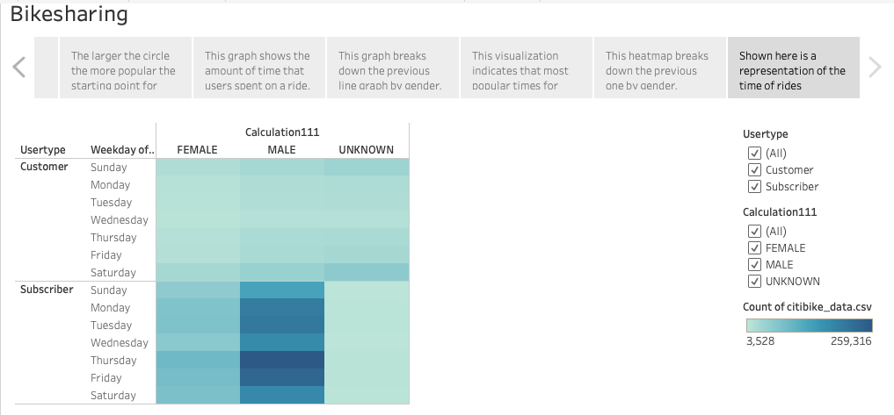

# tableau_bikesharing

## Overview

The purpose of this analysis was to analyze bikesharing data in New York City using Tableau in order to make a pitch to investors to expand the program to other cities. 

Feel free to explore my analysis using Tableau [here](https://public.tableau.com/views/Challenge_16783932519600/Bikesharing?:language=en-US&publish=yes&:display_count=n&:origin=viz_share_link). 

## Results

### Images

This visualization shows the most popular start times for bikesharing in the month of August. As can be seen, the most popular times are around 8am and 5-6pm. 

In this image, the larger the circle the more popular the starting point for rides.

This graph shows the amount of time that users spent on a ride. Most users spent approximately an average of 10 minutes, above that it is likely users would consider another form of transportation. 

This graph breaks down the previous line graph by gender. 

This heatmap indicates that most popular times for rides are in the morning around 8am and the evening around 5-6pm. 

This heatmap breaks down the previous one by gender. 

Shown here is a representation of the time of rides different usertypes utilize bikesharing services. 

## Summary 

Overall, many of the bikesharing users are subscription based and likely utilize the services for commuting to work. This makes sense when we consider the most popular times that rides are taken (8am and 5-6pm). 

Two additional visualizations I would perform with this dataset:

1. Seeing if there is a correlation between starting location and usertype to answer the question if tourists hop on the bikes more frequently at a particular location. 
2. Looking at the breakdown of starting location by day of the week to see if users hop on the bikes more at a particular location on the weekend/weekday. 